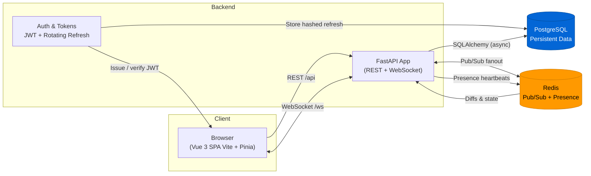

# FastRoom – Real-time Rooms (FastAPI + Vue + Redis + Postgres)

Production-leaning learning project demonstrating a modern realtime stack: authenticated rooms, chat, presence, typing indicators, and a clean separation of concerns between a FastAPI backend and a Vue 3 SPA frontend.

## Stack Overview

- Backend: FastAPI (async), Uvicorn, SQLAlchemy (async), Alembic, Redis (pub/sub + presence), PostgreSQL
- Frontend: Vue 3, Vite, Pinia, vue-router, generated OpenAPI client (axios)
- Tooling: uv (Python packaging), ESLint (flat config), Prettier, Ruff, mypy, pytest
- Infra / Local Dev: Docker Compose (api, web, redis, postgres)

## Architecture



Key points:

- Browser SPA talks to FastAPI via REST for CRUD/auth and a persistent WebSocket for realtime chat + presence.
- Redis handles fanout (multi‑process) and ephemeral presence (heartbeat keys -> diffs/state messages).
- PostgreSQL stores users, rooms, messages, membership, and hashed refresh tokens (rotation + revocation list semantics).
- Rotating refresh tokens reduce replay window; access tokens stay short‑lived.

## Key Features

- JWT access tokens + rotating refresh tokens (hashed persisted) with revocation
- Rooms CRUD, membership & moderation (mute, ban, promote/demote moderator)
- Persistent chat history with pagination, edit & delete (with WS fanout)
- Presence via Redis heartbeat keys (diff + full state messages)
- Typing indicators, backlog on join, incremental history loading
- Multi-process/WebSocket fanout via Redis pub/sub (srv tag to avoid echo)
- Cleanly generated TypeScript client from OpenAPI spec

## Repository Structure

```text
.
├── docker-compose.yml          # Compose services: api, web, redis, postgres
├── .pre-commit-config.yaml     # Python lint/type/format hooks
├── backend/
│   ├── Dockerfile.api          # Multi-stage Python build (uv)
│   ├── pyproject.toml          # Project + deps (prod/test/dev extras)
│   ├── alembic.ini             # Alembic config
│   ├── migrations/             # Alembic migration scripts
│   └── src/fast_room_api/
│       ├── api/                # FastAPI app + routers
│       ├── models/             # Pydantic + ORM models + config
│       ├── logging_config.py
│       └── tests/              # pytest suites (unit + integration)
├── frontend/
│   ├── Dockerfile.web          # Node build then nginx serve
│   ├── package.json
│   ├── vite.config.ts          # Dev server + proxy (/api, /ws)
│   └── src/
│       ├── components/         # Shared UI pieces
│       ├── pages/              # Route-level views
│       ├── stores/             # Pinia state (auth etc.)
│       ├── utils/              # WebSocket & helpers
│       ├── plugins/            # App plugins (auth client)
│       └── generated/openapiclient/  # AUTO-GENERATED: do not edit
└── README.md                   # (this file)
```

See `backend/README.md` and `frontend/README.md` for deeper service-specific details.

## Quick Start

### 1. Local (no Docker)

Backend:

```bash
cd backend
uv venv
source .venv/bin/activate
uv sync
uv run src/fast_room_api/api/main.py
```

Frontend:

```bash
cd frontend
yarn
yarn dev
```

Navigate to <http://localhost:5173> (API on <http://127.0.0.1:8000> by default).

### 2. Docker Compose

From repo root:

```bash
docker compose up --build
```

Services:

- API: <http://localhost:8000>
- Frontend: <http://localhost:5173>
- Redis: localhost:6379
- Postgres: localhost:5433 (db `fastroom`, user/pass `postgres`)

### 3. Regenerate OpenAPI Client

Start backend, then:

```bash
cd frontend
yarn generate:client
```

## Environment Variables (Summary)

Backend (see `backend/README.md` for full list):

- `FASTROOM_SECRET` – JWT signing secret (change in prod)
- `DATABASE_URL` – async DB URL
- `WS_HEARTBEAT_INTERVAL` / `WS_HEARTBEAT_TTL_MS` – presence timings
- `SERVER_ID` – optional override for process id tag

Frontend:

- `VITE_WS_URL` – WebSocket endpoint (defaults to `ws://localhost:8000/ws`)

Compose sets Postgres and DB URL automatically for the API container.

## Testing

Backend tests:

```bash
cd backend
uv run pytest -q
```

(Frontend tests not yet implemented – roadmap includes Vitest + Playwright.)

## Lint & Format

Backend (pre-commit can automate on commit):

```bash
pre-commit run --all-files
```

Frontend:

```bash
cd frontend
yarn lint
yarn format:check
```

## WebSocket Protocol (High-Level)

Inbound: `join`, `leave`, `chat`, `history_more`, `typing`, `ping`.

Outbound: `system`, `joined`, `presence_state`, `presence_diff`, `chat`, `history`, `history_more`, `typing`, `pong`, `error`.

Presence: heartbeat keys `presence:hb:{room}:{username}:{connId}` refreshed every interval; first key triggers diff `join`, deletion triggers `leave` diff.

For exhaustive details see backend README section “WebSocket Protocol”.

## Data Flow (Simplified)

1. User registers & logs in -> gets access + refresh tokens.
2. SPA stores tokens (refresh token secure storage recommendation) and opens WS with access token.
3. Join room -> server ensures membership, sends backlog + presence state.
4. Chat messages persist to Postgres, fanned out locally + via Redis to all processes.
5. Presence maintained by heartbeat; disconnect triggers immediate presence diff.
6. Refresh flow rotates refresh tokens (old revoked) for long-lived sessions.

## Code Generation & Types

OpenAPI spec at `/openapi.json` drives TypeScript client generation (axios wrapper) to keep frontend strongly typed for REST calls. WebSocket message types will later be unified into a shared schema.

## Contributing

Contributions are welcome! Please follow the guidelines in [`CONTRIBUTING.md`](./CONTRIBUTING.md).

## Security Notes

- Always override `FASTROOM_SECRET` outside local dev.
- Rotate secrets and revoke outstanding refresh tokens upon compromise.

## License

This project is licensed under the MIT License. See the [LICENSE](./LICENSE) file for details.

---
Additional deep-dive docs live in: [`backend/README.md`](./backend/README.md) and [`frontend/README.md`](./frontend/README.md).
